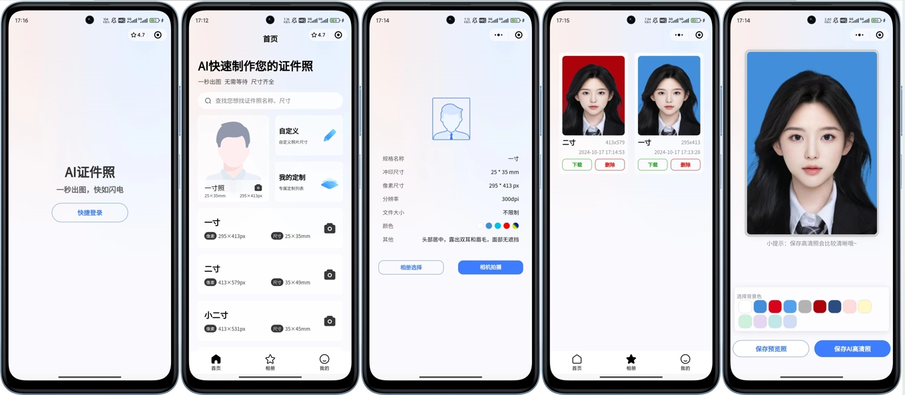
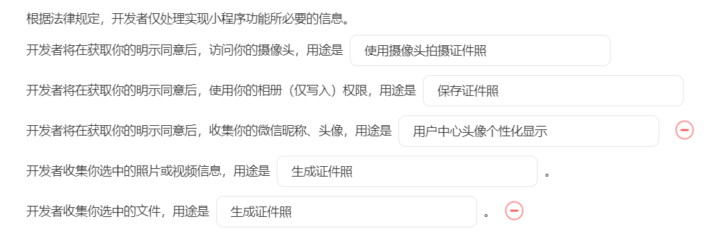

# 项目介绍

# 
证件照伴侣

全新一套前端，小而巧，雅而美

**相关项目**：

- 小程序前端第一套：https://github.com/no1xuan/photo
- 小程序前端第三套：https://github.com/no1xuan/id-photo-wechat
- 小程序后端：https://github.com/no1xuan/HivisionIDPhotos-wechat-weapp
- 小程序管理员网页后台：https://github.com/no1xuan/zjzAdmin

------

# ⭐最近更新
    版本更新教程：https://www.bilibili.com/video/BV1xNUvYTEjo

- 2024.11.29：优化加快规格列表/搜索列表/照片列表，修复作品列表特殊场景删除造成不分页的问题，固定微信基础库版本：2.32.3，请勿调高此基础库版本，会出现报错，但不影响使用，暂时没时间解决
- 2024.11.08：修复定制尺寸dpi不生效的问题
- 2024.11.05：增加登录失败时控制台打印错误原因
- 2024.10.18：修复高清照一直没生效的问题
- 2024.10.17：第一个版本诞生
- 注：欢迎大家提交PR，共同维护和推动开源项目的发展
------

# 🔧部署

微信开发者工具打开项目后，修改一个地址就好啦

## 隐私协议

## 客服配置

## 📧其它

您可以通过以下方式联系我:

QQ: 24677102

微信：webxuan
