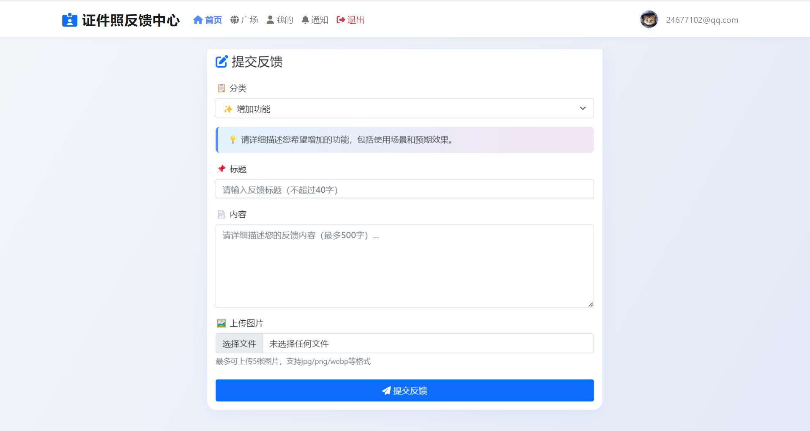

# 📝反馈

目前我正在进行程序大更新，新版本**不支持平滑升级**！

---

##### 对于二开者

新版本决定牺牲一些性能和速度以提高便利性，但仍然**不提供接口文档**。  
如果你希望保留性能和速度，请保留 **2025.05.03** 版本的前后端代码，包括管理员端。

---

##### 提交您的想法

- 目前 HivisionIDPhotos 的功能、性能和 bug 已经无法满足需求，如果你懂 Python，希望你能利用业余时间参与 HivisionIDPhotos 魔改计划
- 如果你有更好的想法、发现 bug、喜欢别的小程序页面、觉得别的小程序某个功能或逻辑很好等等……
- 欢迎提交反馈，因为一个人的想法是有限的，但我希望产品能让大家都满意

<h3 align="center">
  反馈提交地址: <a href="https://fk.0po.cn">https://fk.0po.cn</a>
</h3>

# 项目介绍

# 
证件照伴侣

2025我们一起加油，心如所愿，梦想成真.

**相关项目**：

- 小程序前端第一套：https://github.com/no1xuan/photo
- 小程序前端第三套：https://github.com/no1xuan/id-photo-wechat
- 小程序后端：https://github.com/no1xuan/HivisionIDPhotos-wechat-weapp
- 小程序管理员网页后台：https://github.com/no1xuan/zjzAdmin

------

# ⭐最近更新
    版本更新教程：https://www.bilibili.com/video/BV1xNUvYTEjo

- 2025.09.26：解决微信隐私更新导致小程序不过审问题，移除微信失效的赏好评
- 2024.END：  2024年最后一个版本，增加管理员后台登录，去除彩蛋
- 2024.12.17：修复首页一寸照跳转信息错误，定制尺寸增加引导，增加美颜，相机增加返回，登录状态检查，适配新版后端
- 2024.11.29：优化加快规格列表/搜索列表/照片列表，修复作品列表特殊场景删除造成不分页的问题，固定微信基础库版本：2.32.3，请勿调高此基础库版本，会出现报错，但不影响使用，暂时没时间解决
- 2024.11.08：修复定制尺寸dpi不生效的问题
- 2024.11.05：增加登录失败时控制台打印错误原因
- 2024.10.18：修复高清照一直没生效的问题
- 2024.10.17：第一个版本诞生
- 注：欢迎大家提交PR，共同维护和推动开源项目的发展
------

# 🔧部署

微信开发者工具打开项目后，修改一个地址就好啦

## 隐私协议

## 客服配置

## 📧其它

您可以通过以下方式联系我:

QQ: 24677102

微信：webxuan
